# Reinforcement-Learning
This is my Master's Thesis and I have trained agents to do several tasks with Reinforcement Learning algorithms and I created the environments with Unity (using the library of ML-Agents). 
 
Algorithms: DQN, Actor-Critic, A3C, A2C, PPO (using the library of Pytorch for Neural Networks).

See my Master's Thesis pdf [here](/Master's_Thesis_Nicola_Toscano.pdf).

Full videos of agents playing in the environments [here](https://www.youtube.com/watch?v=8SCooJGiudY&list=PLLgEmBLy9m7ZRTyYV_AngeMJGhWlip7sj&index=4).
 
## Environment 1
In the first environment, the agent (black / white cube) is on a platform, where he can fall from it and his objective is to touch the orange cube.

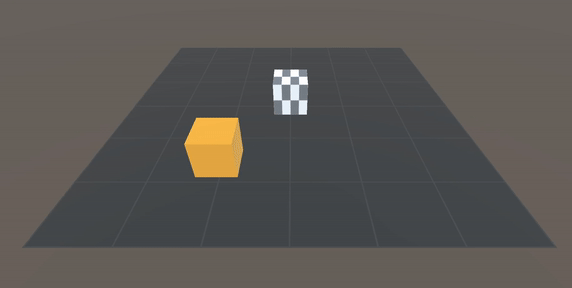

### Training plot:
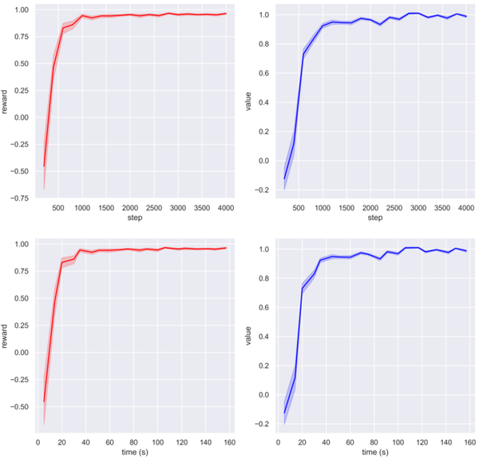

## Environment 2
The second environment is very similar to the first, but some difficulty is added which is that the agent (blue cube), now has a much smaller field of vision. Therefore has to move not only to simply touch his target (orange cube) , but also to find where it is. In the first environment the agent regardless of the position in which he was, always detected the orange cube.

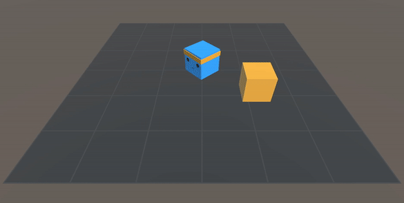

### Training plot:

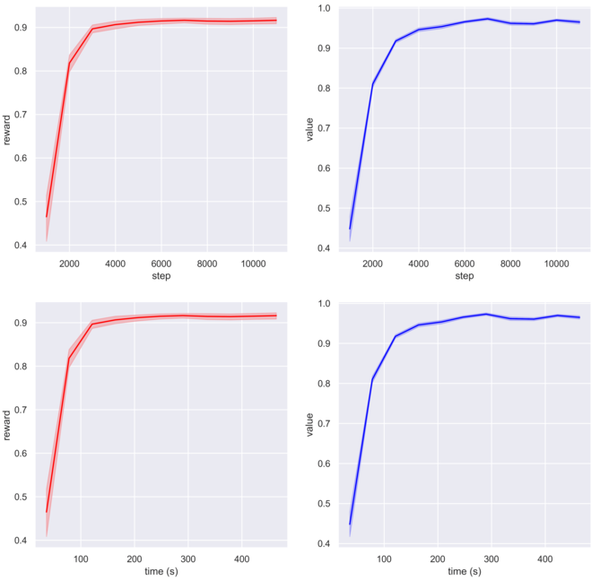

## Environment 3
In this environment, the agent's objective is to get the ball into the goal. Until now the agent only had to learn a single relationship, touch his target. Instead, in this environment he has to learn more than one relationship, touch the ball and then put it in the goal.
The agent makes a first pitch, if the ball goes into the goal, the episode ends and if it fails, the ball will bounce off one of the walls of the field and the agent can continue trying until he succeeds within the limit maximum steps per episode.

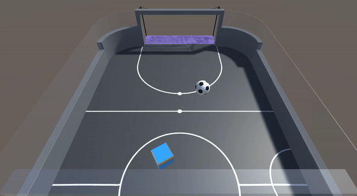

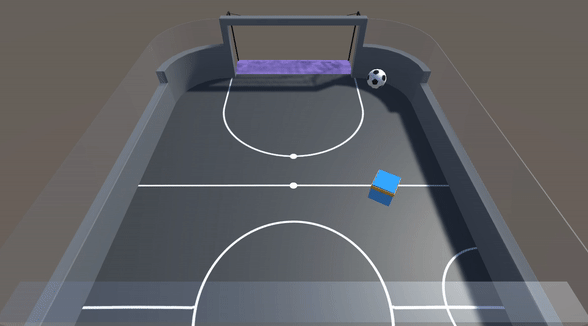

### Cam in first person:

### Training plot:

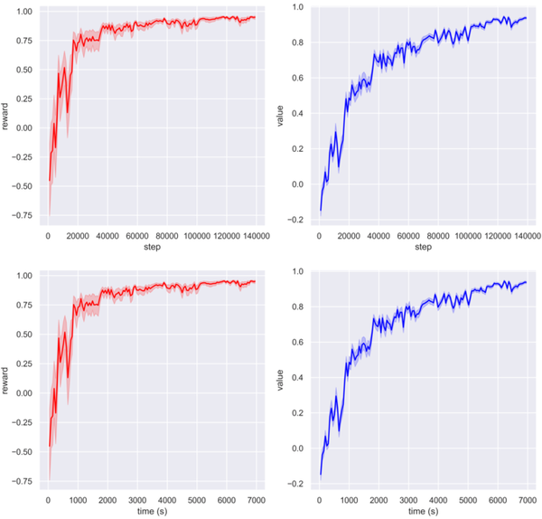

## Environment 4
This environment has 2 identical agents and what has been intended is that they cooperate with each other. The objective of both is that one of them, no matter what it is, enters the green zone. In order to enter this zone, one of them must stay in the orange zone, so that the blue wall disappears and the other agent can access the green zone.

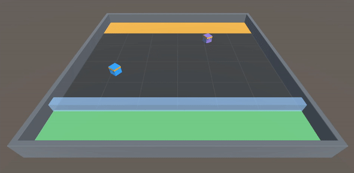

### Training plot:

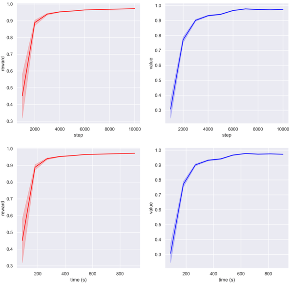

## Environment 5
In the last environment, it is intended that the agent learn a more complicated task, which involves relating a greater number of things, compared to the previous environments. It is also a very stochastic environment, therefore the agent will also have to explore and learn a wide variety of situations.
The agent aims to enter the green zone, first he has to place the two blocks in each zone of their respective color, then the blue wall will disappear and he will be able to access the green zone.

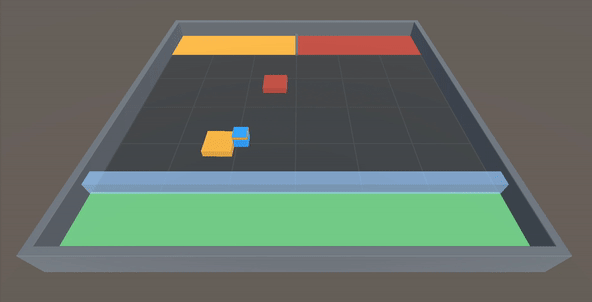

### Cam in first person:

### Global cam:

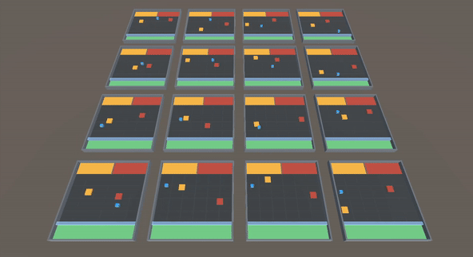

### Training plot:

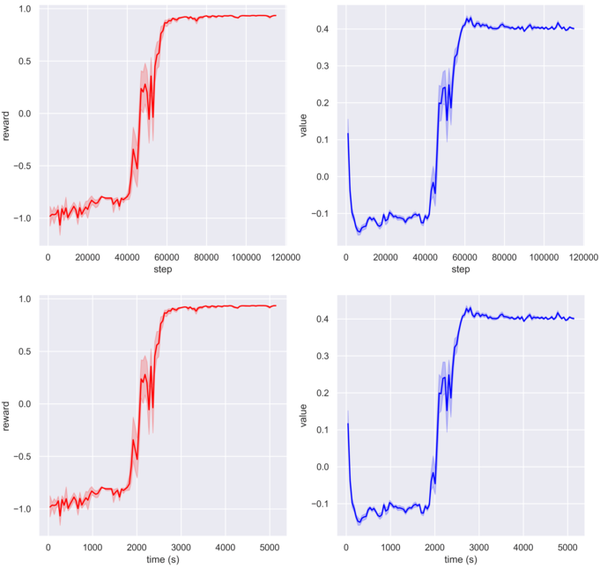
